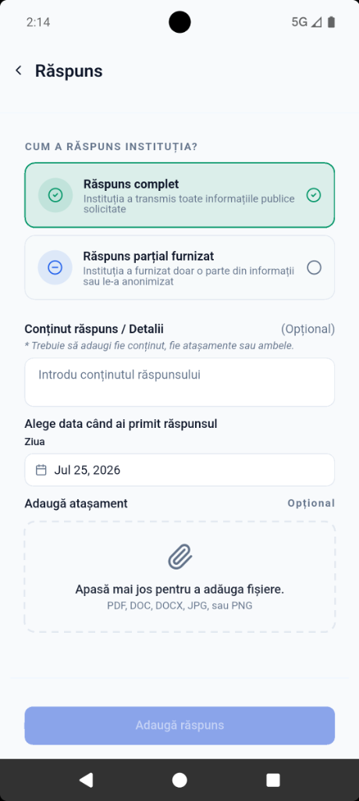
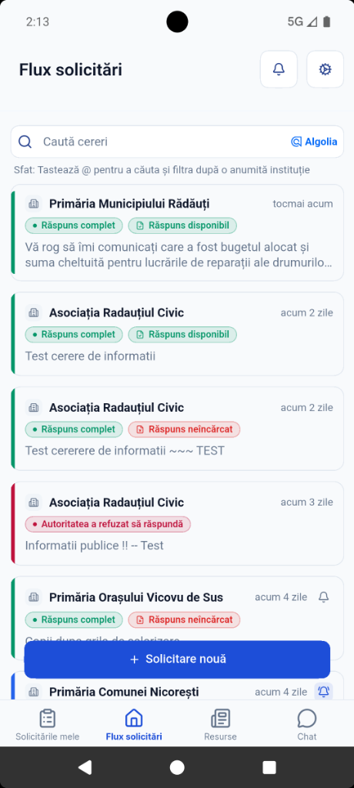

# Access Info Public (`accessinfo_p`)

A modern, open-source Flutter mobile application for public transparency, civic requests, and official petition tracking.

---

## 🌟 Overview

**Access Info Public** (`accessinfo_p`) is a mobile application built with Flutter that empowers citizens to query public information, file petitions, and track responses from local authorities and public institutions.

This project is structured adhering strictly to Clean Architecture principles, ensuring maintainability, testability, and clear separation of concerns across presentation, domain, and data layers.


---

## 📱 Screenshots

| Public Feed (`Flux solicitări`) | Request Details (`Detalii cerere`) |
| :---: | :---: |
|  |  |

| Manage Request (`Gestionează`) | Add Response (`Răspuns`) | Updated Feed |
| :---: | :---: | :---: |
|  |  |  |

### Key Features Highlighted
- 📜 **Public Requests Stream:** Browse transparent public requests sent to local municipalities and institutions with live status indicators.
- 📄 **Detailed Information & Attachments:** View request details, status timelines, and attached response documents (DOCX, PDF, etc.).
- ⚙️ **Request Management:** Action controls to record responses, attach files, or log refusal of public disclosures.
- 📝 **Response Logging:** Interface to log official responses with custom status tagging, received dates, and file attachments.

---

## 🛠 Tech Stack & Libraries

- **Framework:** [Flutter](https://flutter.dev/) (Dart 3+)
- **State Management:** [Flutter BLoC / Cubit](https://pub.dev/packages/flutter_bloc)
- **Dependency Injection:** [GetIt](https://pub.dev/packages/get_it) & [Injectable](https://pub.dev/packages/injectable)
- **Immutable Models & Union Types:** [Freezed](https://pub.dev/packages/freezed) & [JsonSerializable](https://pub.dev/packages/json_serializable)
- **UI Components & System:** [Forui UI Framework](https://forui.dev/)
- **Backend & Services:** Firebase (Authentication, Firestore, Storage, Cloud Messaging)
- **Localization:** Flutter Gen l10n (`context.l10n`)

---

## 🏛 Architecture

The project enforces a strict multi-layered Clean Architecture pattern:

```
lib/features/<feature>/
├── domain/
│   ├── entities/
│   ├── repositories/       ← Abstract interface contracts
│   └── use_cases/          ← Self-contained business logic
├── data/
│   ├── repositories/       ← Concrete repository implementations
│   ├── data_sources/       ← Firebase / API interaction
│   └── dtos/               ← Data transfer objects & JSON mappers
└── presentation/
    ├── cubits/             ← State management
    ├── screens/            ← Feature screens
    └── widgets/            ← Modular UI components
```

### Layer Flow Rules
`UI` → `Cubit` → `UseCase` → `Repository` → `DataSource`

---

## 🚀 Getting Started

### Prerequisites

- [Flutter SDK](https://docs.flutter.dev/get-started/install) (3.24.x or newer)
- [Dart SDK](https://dart.dev/get-started/sdk) (3.5.x or newer)
- [Firebase CLI](https://firebase.google.com/docs/cli) (if modifying Firebase backend services)

### Installation

1. **Clone the Repository:**
   ```bash
   git clone git@github.com:SK1n/accessinfo_p.git
   cd accessinfo_p
   ```

2. **Install Dependencies:**
   ```bash
   flutter pub get
   ```

3. **Run Code Generation:**
   ```bash
   dart run build_runner build -d
   ```

4. **Launch the App:**
   ```bash
   flutter run
   ```

---

## 🧪 Testing & Quality Assurance

To ensure code quality and zero static analysis issues, run:

```bash
# Static analysis check
flutter analyze

# Run unit & widget tests
flutter test
```

---

## 📝 License

This repository is maintained for public transparency and open-source civic initiatives.
