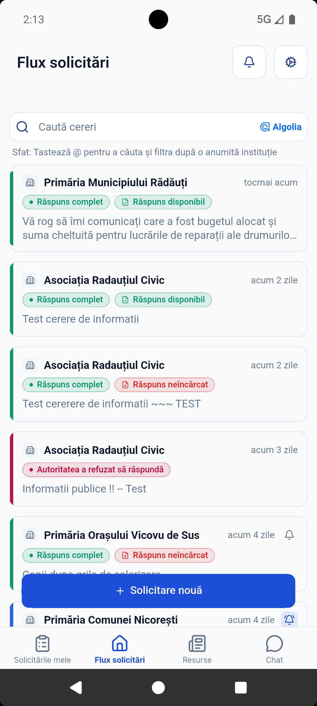
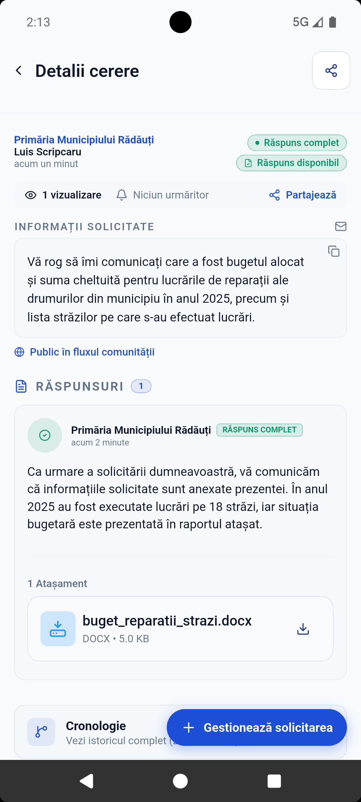
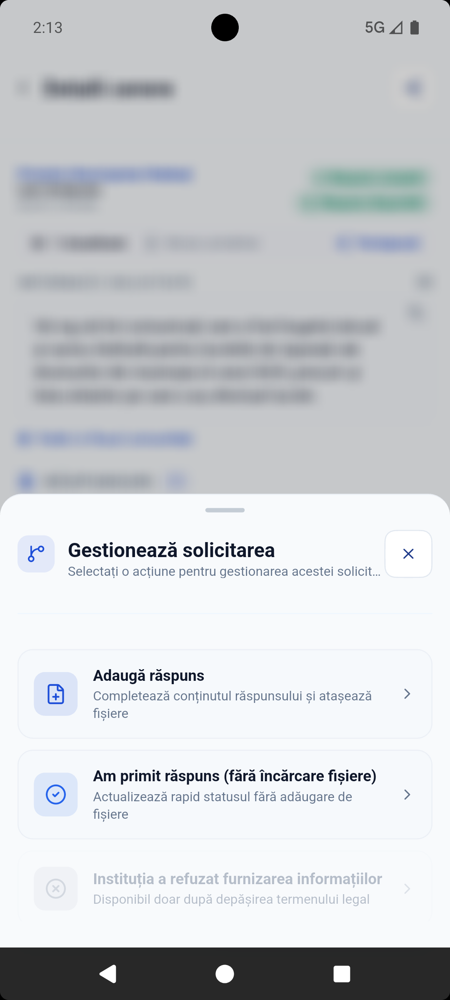
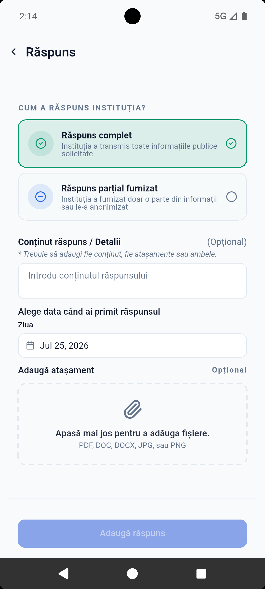
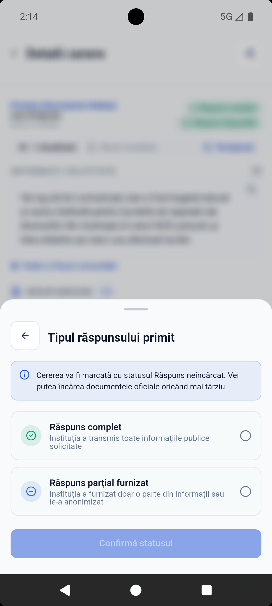
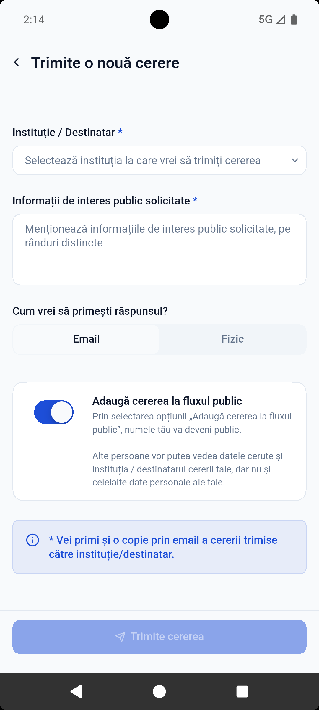
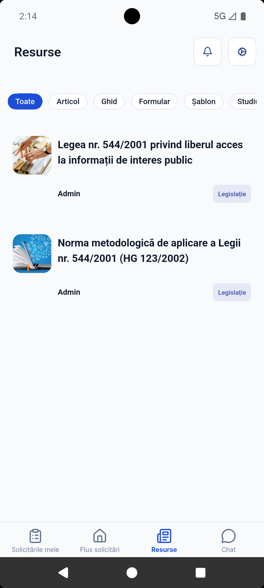
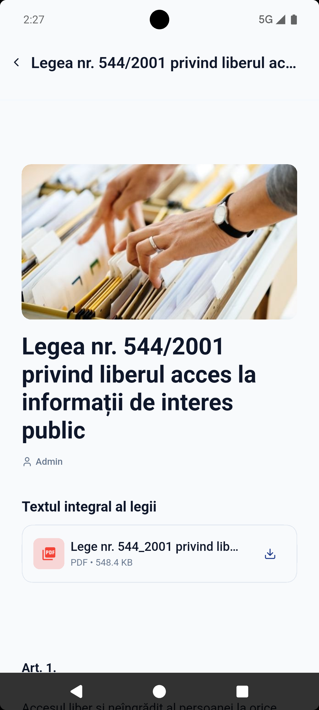

# Access Info Public (`accessinfo_p`)

A modern, open-source Flutter mobile application for public transparency, civic requests, and official petition tracking.

---

## 🌟 Overview

**Access Info Public** (`accessinfo_p`) is a mobile application built with Flutter that empowers citizens to query public information, file petitions, and track responses from local authorities and public institutions.

This project is structured adhering strictly to Clean Architecture principles, ensuring maintainability, testability, and clear separation of concerns across presentation, domain, and data layers.


---

## 📱 Screenshots & Application Features

| **Request Feed** | **Request Detail View** | **Manage Request Modal** |
| :---: | :---: | :---: |
|  |  |  |
| **Request feed** — a public list of requests from all users, each tagged by status (full response, response not uploaded yet, authority refused to respond), with search and a "New request" button. | **Request detail view** — shows a submitted request with status tags ("Full response," "Response available"), the request text, the institution's reply, and an attached document. | **Manage request modal** — options to add a response, mark a response as received without uploading files, or flag that the institution refused to provide information (this option unlocks only after the legal deadline passes). |

<br/>

| **Add Response Form** | **Response Type Modal** | **New Request Form** |
| :---: | :---: | :---: |
|  |  |  |
| **Add response form** — user selects whether the institution's answer was full or partial, adds details, sets the date received, and attaches files. | **Response type modal** — a lighter version of the response form, used when logging a reply without attaching documents yet. | **New request form** — pick the institution, describe the information requested, choose email or postal reply, and optionally publish the request to the public feed. |

<br/>

| **Resources Tab** | **Law 544/2001 Detail View** | **Chat Tab** |
| :---: | :---: | :---: |
|  |  |  |
| **Resources tab** — reference material on Law 544/2001 and its implementing methodology, filterable by content type (article, guide, form, template, study). | **Law 544/2001 Detail View** — full text of Law 544/2001, opened from the Resources tab, with a downloadable PDF and the article-by-article text below (Article 1 visible here). | **Chat tab** — direct messaging between users, separate from the request-filing flow. |

---

## 🛠 Tech Stack & Libraries

- **Framework:** [Flutter](https://flutter.dev/) (Dart 3+)
- **State Management:** [Flutter BLoC / Cubit](https://pub.dev/packages/flutter_bloc)
- **Dependency Injection:** [GetIt](https://pub.dev/packages/get_it) & [Injectable](https://pub.dev/packages/injectable)
- **Immutable Models & Union Types:** [Freezed](https://pub.dev/packages/freezed) & [JsonSerializable](https://pub.dev/packages/json_serializable)
- **UI Components & System:** [Forui UI Framework](https://forui.dev/)
- **Backend & Services:** Firebase (Authentication, Firestore, Storage, Cloud Messaging)
- **Localization:** Flutter Gen l10n (`context.l10n`)

---

## 🏛 Architecture

The project enforces a strict multi-layered Clean Architecture pattern:

```
lib/features/<feature>/
├── domain/
│   ├── entities/
│   ├── repositories/       ← Abstract interface contracts
│   └── use_cases/          ← Self-contained business logic
├── data/
│   ├── repositories/       ← Concrete repository implementations
│   ├── data_sources/       ← Firebase / API interaction
│   └── dtos/               ← Data transfer objects & JSON mappers
└── presentation/
    ├── cubits/             ← State management
    ├── screens/            ← Feature screens
    └── widgets/            ← Modular UI components
```

### Layer Flow Rules
`UI` → `Cubit` → `UseCase` → `Repository` → `DataSource`

---

## 🚀 Getting Started

### Prerequisites

- [Flutter SDK](https://docs.flutter.dev/get-started/install) (3.24.x or newer)
- [Dart SDK](https://dart.dev/get-started/sdk) (3.5.x or newer)
- [Firebase CLI](https://firebase.google.com/docs/cli) (if modifying Firebase backend services)

### Installation

1. **Clone the Repository:**
   ```bash
   git clone git@github.com:SK1n/accessinfo_p.git
   cd accessinfo_p
   ```

2. **Install Dependencies:**
   ```bash
   flutter pub get
   ```

3. **Run Code Generation:**
   ```bash
   dart run build_runner build -d
   ```

4. **Launch the App:**
   ```bash
   flutter run
   ```

---

## 🧪 Testing & Quality Assurance

To ensure code quality and zero static analysis issues, run:

```bash
# Static analysis check
flutter analyze

# Run unit & widget tests
flutter test
```

---

## 📝 License

This repository is maintained for public transparency and open-source civic initiatives.
